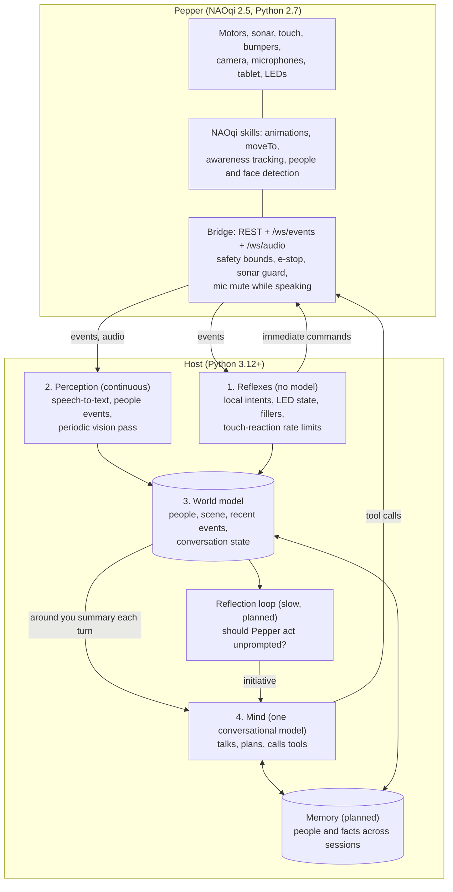

# Architecture

The goal is presence: a robot that is attentive, consistent and responsive enough to feel like someone in the room. This document describes the design that the milestones in [ROADMAP.md](ROADMAP.md) build towards, what exists today, and the rules that keep it coherent. The research behind it is in [RESEARCH_2026-09.md](RESEARCH_2026-09.md); the numeric safety bounds are in [SAFETY.md](SAFETY.md).

## The shape in one paragraph

Pepper's body runs a thin bridge that exposes its hardware as bounded, documented endpoints and reflexes. Everything that thinks runs off-board on the host, in four layers that run at different speeds: reflexes that never call a model, perception that runs continuously, a shared world model that holds what Pepper currently knows, and one conversational mind that talks and decides. Layers communicate through the world model and through events, never by reaching into each other. Many models can do the work, but only one of them is Pepper's voice.

## Layers

### 1. Reflexes: milliseconds, no model

Things a person expects instantly and that must never wait for a model call: "stop" and "be quiet", the emergency stop, safety limits, eye colours that show listening, thinking and speaking, a filler ("Hmm.") when the mind is slow, and rate limits on touch reactions. Most live on the host (`src/ai/intents.py`, `src/ai/manager.py`); the safety-critical ones also live on the bridge, so they hold even if the host misbehaves (sonar guard, motion refused while resting or halted, microphone muted while Pepper speaks, animation time limit).

**Status:** built and verified on the robot (Milestone 1).

### 2. Perception: continuous, cheap, specialised

Turns raw sensing into facts: speech into text, NAOqi's people detection into "someone arrived", camera frames into a short scene description. It runs all the time, independently of whether anyone is talking to Pepper, and each part uses the fastest tool that is good enough: NAOqi's on-robot detectors are free; speech-to-text runs locally (sherpa-onnx); the periodic vision pass uses a fast vision model at a low rate (every 10 to 20 s, and at once when the people count changes). Perception writes to the world model and emits events; it never speaks.

**Status:** speech-to-text is built and verified (Milestone 2). People events are debounced on the bridge with distance, gaze and zone per person, and feed the world model (2026-09-23). The vision pass is planned (Milestone 4).

### 3. World model: the shared state

One structure on the host that holds what Pepper currently believes about its surroundings: who is present (with first-seen and last-seen times, distance zone, whether they are looking at Pepper, a name once identity exists), the latest scene summary and when it was made, recent events (arrivals, touches, what was just said), and the state of the conversation. It is plain data in our own code, not inside any model, which is what lets every other part read it and lets models be swapped freely.

- Perception and reflexes write to it.
- The mind reads a compact "around you" summary in its context on every turn, and can ask for detail through a tool.
- The reflection loop reads it to decide whether to act.
- Memory persists selected parts across sessions.

**Status:** first slice built (2026-09-23): `src/world/model.py` tracks who is in view (distance, gaze, how long, recent arrivals and departures) and the mind gets an "Around you" sentence on every turn. Scene descriptions, a detail tool and memory come next.

### 4. Mind: one voice

A single conversational model holds the dialogue, decides what to do, calls tools and speaks. One model rather than several keeps one personality and one line of context: the person is talking to one Pepper. Its reply streams sentence by sentence to the robot's voice, gestures go inline in the speech, and it is told to start answering in words before acting.

**Status:** built (Claude, configurable with `AI_MODEL` / `AI_EFFORT`). Five configurations were compared on the robot on 2026-09-22; Sonnet 5 at medium effort is the working choice.

### Beyond the four layers

- **Reflection loop (planned, after Milestone 4).** A slow background loop that looks at the world model every so often and decides whether Pepper should act unprompted: greet someone who has just arrived, notice that a person has been waiting, follow up on something said earlier. This is what turns a responsive robot into one with initiative. It hands its decision to the mind as an event turn, so there is still only one voice.
- **Memory (Milestone 5).** Who Pepper has met and what it has learned, kept across sessions, with face or voice identity so it can recognise someone.

## Which model does what

| Job | Where it runs | Speed | Model |
|-----|---------------|-------|-------|
| Control phrases, safety, state signals | host and bridge | milliseconds | none |
| People and face detection, tracking | on the robot (NAOqi) | continuous | NAOqi's own |
| Speech to text | host CPU | about 0.3 s of compute per audio second, final about 0.2 s after you stop | NVIDIA Nemotron speech streaming via sherpa-onnx (chosen 2026-09-22: 6 % word errors in the open room vs 37 % for the older zipformer) |
| Scene description for the world model | Creative AI Hub server (planned), over the tailnet | every 10-20 s | an open vision-language model on local GPUs, chosen by comparison; a cloud model as fallback |
| Conversation, decisions, tool use | cloud | 2-4 s to the first word | one Claude model: Sonnet 5 at medium effort, chosen by comparison on 2026-09-22 |
| Reflection (should I act?) | cloud | every tens of seconds | a small, cheap model, or the mind at low effort |

The rule behind the table: specialised models may observe and summarise, but only the mind speaks and acts. That keeps speed where it matters without splitting Pepper into several personalities.

## Rules that keep it coherent

1. **Safety lives lowest.** Every bound that protects people is enforced on the bridge, where no model and no host bug can bypass it. The host adds conveniences on top, never exceptions.
2. **Nothing waits for a model that does not have to.** If a reply can be given without the model, it is; if the model is needed, Pepper shows that it is thinking.
3. **One voice.** Only the mind speaks and calls action tools. Other layers write facts and raise events.
4. **State in our code, not in a model.** The world model and memory are ours; models read summaries of them. Swapping a model never loses what Pepper knows.
5. **Frames stay in memory at runtime.** In normal operation camera images are never written to disk; the world model holds text, and Pepper signals visibly while it is looking. Development test runs are the exception: comparison scripts may keep photos and recordings locally as a record of the work (`results/`, `recordings/`), but these are git-ignored and never leave the machine. Pepper works in a public room, so anything recorded may include bystanders.
6. **Measure on the robot.** Timing, accuracy and behaviour are judged on Pepper in the room, not only in tests; each finding goes into HANDOFF.md.

## What "presence" means here

Presence is built from three things, each mapped to work:

- **Embodiment**: it looks at you, reacts to touch, gestures while it talks, answers quickly and stops when told. Mostly built (Milestones 0 to 2).
- **Awareness and initiative**: it knows who is around and does something about it without being asked. The world model and reflection loop (Milestone 4 and after).
- **Continuity**: it remembers you and what happened. Memory (Milestone 5).

Whether any of this amounts to sentience is not something the project can claim or test. The aim is a robot whose attention, consistency and responsiveness make it feel like a presence, and every part of that can be measured.
