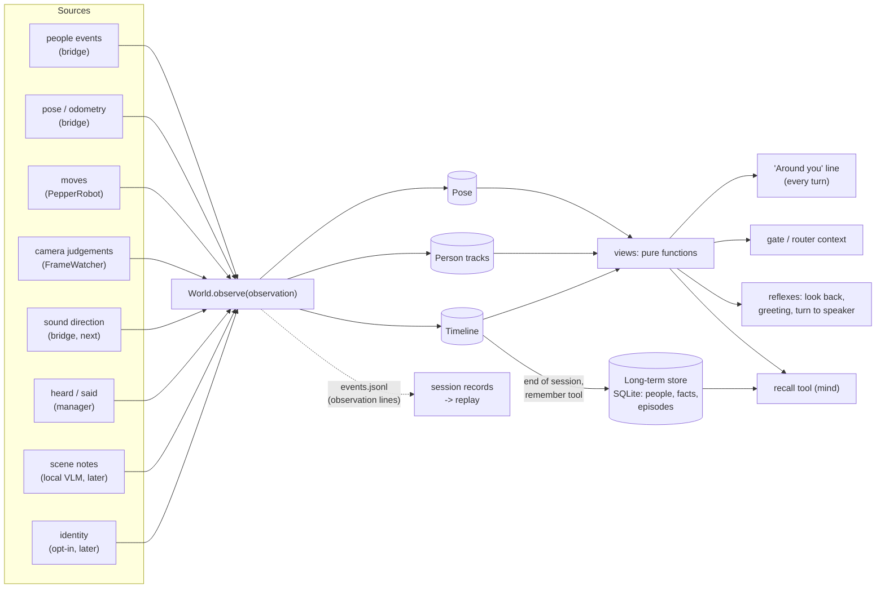

# Memory: where Pepper keeps what it knows

Status: design, 2026-10-08. The first slices are being built offline (see "Build order"). This document is the plan that Milestones 4 and 5 and issues #27, #12, #24, #11, #13, #14 build on, so that each new piece plugs into one structure instead of being wired to the others by hand. `ARCHITECTURE.md` places it among the layers; this is the detail.

It was drafted with an independent proposal from a second model (Claude Fable 5.1, asked to read the code and the robot session records). The two agreed on the shape. The proposal's sharpest point is kept here: remembering where someone stood a minute ago and remembering someone's name next week are different problems. They share a vocabulary, but not a store.

## What went wrong without it

From the robot session on 2026-10-08 (`docs/HANDOFF.md`):
- After "turn ninety degrees", the person was out of view, and "turn towards me" had nothing to go on. Pepper asked "left or right?" and needed four turns to face them again. Replaying that session by hand shows that simply keeping count of Pepper's own turns would have predicted where the person reappeared (-50.9° predicted, -50.4° seen).
- "Come to me" failed because NAOqi's detector loses people every few seconds.
- The addressee judgement never saw what Pepper itself had just said.
- Conversation state is scattered across the manager in half a dozen timestamps.
- Nothing survives a restart, so Pepper cannot remember anyone.

## Two tiers, one vocabulary

| | Working memory (the world model) | Long-term memory |
|---|---|---|
| Holds | where Pepper is and which way it faces; who is around and where, including people just out of view; what just happened (moves, what was said by whom, camera events, scene notes) | people who chose to be remembered, facts about them and the lab, a short record of each session |
| Lifetime | seconds to minutes; gone at restart (the odometry frame resets with NAOqi anyway) | weeks; deleted on request or when it expires |
| Personal data | positions and recent words, as in the session records | names, facts, later face or voice identity: opt-in only |
| Code | `src/world/` (exists: `WorldModel`) | `src/memory/` (new) |
| Storage | in-process, bounded | one SQLite file on the host (`MEMORY_DIR`), git-ignored |
| Read on every turn | yes, as one "Around you" sentence (no model call, a few dozen numbers) | no; through a `recall` tool when the mind needs it, plus a one-line hint when a known person is present |

The shared vocabulary is in `src/world/` and is the only thing both tiers import:

- **Observation**: one thing a sensor or judge reported. Fields: `source`, `kind`, `at`, `frame`, `confidence`, `data`. Append-only.
  - Sources: `people`, `pose`, `motion`, `camera`, `sound`, `scene`, `heard`, `said`, `identity`, `mind`.
  - Frames: `body`, `head`, `odom`.
- **Pose**: Pepper's own position and heading `(x, y, theta)` in the odometry frame, with how it is known (`measured` from the bridge or `dead_reckoned` from commanded moves) and whether it is uncertain.
- **PersonTrack**: one person as the host follows them. Fields:
  - a host-assigned id (NAOqi's ids change whenever it loses someone), first and last seen;
  - position in the odometry frame when the distance is known, otherwise a bearing only;
  - gaze, distance, when they last spoke and were answered;
  - later, an identity (a long-term person id and a confidence) and a name.
- **Event**: an entry in the timeline. Kinds: arrival, departure, greeting, move (asked and measured), utterance heard (with the addressee verdict), sentence said by Pepper, camera event, scene note, "moved unexpectedly".

## Flow



Rules:
1. **One way in.** Everything that changes what Pepper believes goes through `WorldModel.observe()`. A new sense is a new module that emits observations with a new `source`. It never touches the tracks or the readers directly.
2. **Readers are pure functions** over the state, in `src/world/views.py`. A new use is a new function.
3. **Nothing on the read path calls a model.** Local models (decision models, a scene model, identity) are sources. They write observations with probabilities, ahead of time.
4. **Only the mind speaks.** Memory never produces speech. It gives the mind a sentence of context and answers its questions.
5. **Never overwrite a known value with "unknown".** A people report without a position must not erase the last known bearing. The 2026-10-08 records have such a report.
6. **Every association is visible.** When a report is matched to a track, or a new track is made, the decision goes into the timeline and the session records, so a bad match shows up in review.
7. **Replayable.** The raw inputs (people events, poses, moves with their measured result, sound, scene notes) are written to `events.jsonl`. `scripts/replay_world.py` feeds a recorded session back through `observe()`, and tests compare the result with what was recorded.

## Frames: keeping directions true while Pepper turns

- **Body frame:** x forward, y left, angles positive to the left (the `turn` tool's convention). NAOqi's people positions arrive in the torso frame, which turns with the base, so the `yaw` in today's people events is already body-relative.
- **Head frame:** the camera. Anything judged from an image (left/centre/right, a point in a photo) is head-relative and must carry the measured head angles (`Photo.head_measured`) to become a body bearing.
- **Odometry frame:** NAOqi's `FRAME_WORLD`, read with `ALMotion.getRobotPosition(True)`. It is fixed from NAOqi start-up and integrated from wheel odometry. On the virtual Pepper a `moveTo(0, 0, 90°)` moved theta by exactly 90.0° and a 0.3 m drive moved x/y by 0.30 m (probe, 2026-10-08). On the robot, turns of ±30° measured 31° (2026-09-22).

Conversions:
- A person seen at body bearing `b` and distance `d` is stored at `(x, y) = pose ⊕ (d cos b, d sin b)` in odometry.
- Their bearing now is `wrap(atan2(y - y_r, x - x_r) - theta)`.
- A turn changes only `theta`; a drive changes the position, and every stored bearing follows from the geometry.
- A person with a bearing but no distance (sound, or a detector report without distance) is stored as a bearing in odometry. It goes stale after the base drives more than about 0.3 m.

Until the bridge reports the pose, the host dead-reckons from its own completed moves (`PepperRobot.turn`, `move_forward`, `move_to`). An interrupted move marks the pose uncertain until the next measured pose arrives.

**Moved unexpectedly:** if the measured pose jumps (more than 15° or 0.3 m from the estimate) while no move of the host's is running, a "moved unexpectedly" event is raised. Causes: someone pushed or carried Pepper, or NAOqi moved the base itself (the desktop NAOqi turns it ±54° while waking up). Every stored position is then demoted to "last seen N s ago, direction unknown".

## People tracks

- **Tiers by age:**
  - *present:* in the latest report.
  - *lost:* not reported for under 5 s, the detector's usual dropouts.
  - *remembered:* a position under 2 minutes old; people move, so older positions are worth little.
  - *gone:* kept in the timeline only.
- **Matching:** single hypothesis, deliberately simple. A report is matched to the nearest track within 20° and 0.7 m (on a tie, the most recently seen). Unmatched reports start new tracks; tracks missing from a report become *lost*. Two people standing close together can be confused; the logged associations let us tune this from the records.
- **NAOqi's count stays authoritative** for arrivals and greetings (today's rules in `WorldModel.update_people` are kept unchanged), so the greeting behaviour verified on the robot does not move.
- **Hints by source:** sound direction (#12) and camera left/right judgements (#24) attach to the nearest track or create a bearing-only one. Identity (#14) attaches a long-term person id to a track.

## What the mind sees

- **Every turn,** one "Around you" sentence. It is today's sentence plus, when nobody is in view and someone was seen in the last two minutes: "you last saw someone 12 s ago, about 90° to your right of where your body points now (turn -90 to face where they were)". It stays one sentence; it is in the dynamic block after the cached prompt, so caching is untouched.
- **A known person in view** (later, opt-in identity) adds a short hint: "Mira is here (you know her: say `recall` to look her up)". The hint carries no facts, so the prompt does not grow.
- **The `recall` tool** (#12, #13) answers detail questions from working memory first, then the long-term store:
  - who was here and where, with ages;
  - Pepper's last moves;
  - the last scene note;
  - the last things said;
  - facts and past sessions about a person.
  It costs one extra model round (about 2 s), which is why everything needed every turn stays in the one sentence.
- **The `remember` tool** (#13) stores a fact the person asked Pepper to remember, or a name they gave, only when the person agreed to be remembered (below).

## Long-term memory

`src/memory/store.py`, using the standard library's `sqlite3` in WAL mode, with one file at `MEMORY_DIR` (default `results/memory/pepper.sqlite`, git-ignored):

```
people   (id, name, consent_at, consent_note, created_at, last_seen_at, expires_at)
identity (person_id, kind: face|voice, embedding, model, created_at)     -- later (#14), only with consent
facts    (id, person_id or NULL for the lab, text, source: person|mind, session, created_at, expires_at)
episodes (session, started_at, ended_at, people, summary)                -- written by code at the end of a run
```

Rules:
- **Nothing is written automatically from working memory.** Writes happen only:
  - through the `remember` tool;
  - through enrolment (a name, later identity), after a spoken "yes" to a question like "Shall I remember you next time?", with the consent noted;
  - through a per-session episode row computed by code: who, how long, what happened, without quotes. People who did not consent appear only as counts.
- **"Forget me"** (an intent) deletes the person's row, identity and facts in one transaction and says so.
  - Identity and personal facts expire after 90 days unless the person renews consent.
  - A sweep runs at start-up.
- **The sign and the docs must say** that "forget me" clears the memory store. Session records are separate development records with their own retention (lab practice), and one switch does not clear both.
- **Search:** plain-text search (SQLite FTS5) over facts and episodes. Embeddings are an option once there are enough facts to need them, through a local embedding model on the GPU machine. The store keeps the text, so an index can be rebuilt at any time.

## Session records and replay

The world model's inputs go into `events.jsonl` as `observation` lines, next to today's kinds:
- `pose` and `move` lines, with the measured result;
- `sound` and `scene` lines, when those exist.

Derived state (the "Around you" string already in `turns.jsonl`) is recorded for checking, never replayed from. `scripts/replay_world.py <session>` rebuilds the world model from a session and prints what it would have said at each turn. The replay script runs on the local session folders only. Tests use hand-written fixtures built from numbers already published in issues and HANDOFF, because session records never leave the host.

## How each issue fits

| Issue | Lands in |
|---|---|
| #27 remember where people were | pose in the odometry frame (bridge `pose` in the sensors snapshot, a `pose` event when it changes, the measured pose returned by moves); tracks with positions; the "Around you" line for people out of view |
| #12 sound localisation, detail tool | sound: a bridge `sound` event (`ALSoundLocalization`, dropped while Pepper speaks) and a `sound` observation; detail: the `recall` tool |
| #24 come to me | `speaker_bearing(at)`, from the sound heard during the utterance or else the nearest remembered track; then turn and drive as today. The camera fallback is a `camera` observation with the head angle attached |
| #11 periodic vision pass | a `scene` observation (short text, pose, head angle) every 10-20 s and when the people change; "last look N s ago" in the summary; detail through `recall`; frames never stored |
| #13 memory tools | `remember` / `recall` over `facts` and `episodes` |
| #14 face or voice identity | an `identity` source that compares embeddings on the host and attaches a long-term person id to a track; enrolment only through the consent flow |
| #18 follow me | a reader: short moves from the track's bearing and distance; stops when the track is lost for over 2 s |
| #6, #7, #28 look at, verify, point | readers: a target from a track or the last photo (shared pixel-to-angle maths with the head pose); verify compares the track before and after |
| #25 the gate sees what Pepper said | `addressee_context()` from the timeline (the last things heard plus Pepper's last sentence and its age); the judgement's wording changes, so the replays are re-run first |
| Reflection loop (later) | a reader that looks at the timeline every so often and raises an event turn for the mind |

## Build order

The store comes first, so the place where remembering people goes exists before anything feeds it. Each slice keeps the robot working (the robot runs the 0.5.1 bridge until the next deploy, so everything must work without the new bridge fields) and is tested offline before the next robot session.

1. **The core and the long-term store.**
   - The core: the shared vocabulary (`Observation`, `Event`), `WorldModel.observe()` and the timeline.
   - The store: `src/memory/` (people, facts, episodes, consent, forget, expiry sweep).
   - The tools and intents: `remember`, `recall` (store and working memory) and the "remember me" / "forget me" intents.
   - An end-of-session episode written by code.
   - Tests use a temporary SQLite file.
2. **Frames, pose and tracks** (#27).
   - Host: `frames.py` and `tracks.py`, with the "Around you" line for people out of view. Dead reckoning from the host's own completed moves is the default path. `WorldModel` keeps its interface.
   - Bridge: the measured pose in the sensors snapshot and in people events; a `pose` event only when the pose has settled after changing by more than 5° or 0.1 m (no stream during a turn); the measured pose in move results. Mirrored in the fake bridge, the fake NAOqi and `BRIDGE_API.md`.
   - Session records: pose and move observations, so sessions can be replayed (`scripts/replay_world.py`, local files only).
   - Tests:
     - unit tests for turn, drive, moved unexpectedly and "never overwrite with unknown";
     - a hand-written fixture with the numbers already in #27 and HANDOFF (turn 70 → person at -0.9°; then +90, +180, -160, -60 → seen again at -50.4°). Session files never go into `tests/`.
     - the virtual Pepper for the bridge pose.
3. **Conversation in the timeline** (#12 detail, #25 groundwork).
   - Heard and said utterances go into the timeline; the manager's scattered timestamps read from it.
   - `addressee_context()`.
   - The gate's wording stays as benchmarked: the 2026-10-01 log has no record of Pepper's sentences, so adding "Pepper just said" waits for a two-person session recorded with them (session records have them since 0.5).
4. **Sound direction** (#12, #24).
   - Bridge `sound` events, the `speaker_bearing` view, and "come to me" from the voice's direction.
   - Tested with the fake NAOqi; the desktop NAOqi has no `ALSoundLocalization`, so the robot verifies it.
5. **Scene notes** (#11): a local vision model writes `scene` observations; candidates and a benchmark on recorded photos below.
6. **Identity** (#14), after the consent flow has been used on the robot; candidates below.

## Models for the later slices (survey 2026-10-08)

Alien3 (RTX 5090, 32 GB) has about 10 GB of GPU memory free next to Nimble and Clef Flash. Candidates found in a survey of recent releases. Release details are from the publishers' pages and are not yet checked on our machine; each is benchmarked on recorded data before it is used.

| Use | First to try | Notes |
|-----|--------------|-------|
| Searching facts and episodes | plain-text search (SQLite FTS5) | enough at this scale. If needed later: `embeddinggemma-2` (Google, Apache-2.0, 270M text encoder with optional image and audio encoders; needs Ollama 0.40 and the bf16 tags) or `qwen3-embedding:0.6b` |
| Per-frame questions (who is where: left/centre/right, how many) | Clef Flash, as today (up to 64 typed questions per image in one call) | Liquid's `d1-3B` (October 2026, a 3B decision model, transformers only) is reported much faster; worth a benchmark |
| Scene notes and boxes (#11, #6, #28) | `qwen3.5:4b` in Ollama with a JSON schema | also `gemma4:e4b` (detection and pointing), Moondream 3.1 (detect/point/caption, about 0.15 s; may need the GPU to itself), Molmo2-ER (pointing) |
| Finding a named object | the boxes from the scene model above | YOLOE-26 (open vocabulary, AGPL) if a dedicated detector is needed |
| Face and body identity (#14) | InsightFace 2.1 PersonAnalysis (`cheetah_s`: face and body detection, ArcFace, body re-identification) | library MIT, **pretrained models for non-commercial research only**; fine for the lab, a problem for anyone deploying it commercially |
| Voice identity, telling voices apart | speaker embeddings from sherpa-onnx (CAM++, TitaNet; already a dependency, runs on the CPU) | could also help the addressee gate: a second voice is evidence of side talk |
| Memory frameworks | none (our own store) | mem0, Graphiti and cognee all use a language model to extract memories; Graphiti's time-aware facts are worth revisiting if facts start changing over time |

## Not building (yet)

- maps, SLAM or occupancy grids;
- multiple hypotheses per person;
- persisting working memory across restarts;
- a vector database or a knowledge graph;
- memory summaries written by the mind every turn;
- face or voice embeddings before the consent flow exists;
- any model call on the read path.
